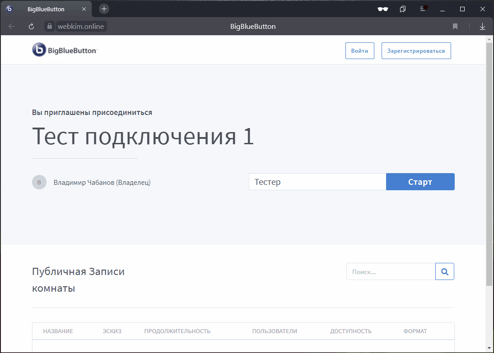

# Экзамен по Программированию

Все обучающиеся допущены к экзамену, не зависимо от количества баллов за практическую часть.

#### Этап I. Тестирование

##### Введение

Тестирование проводится по всем темам изучаемым в семестре и предназначено для оценивания знаний обучающегося. Объём освоенного материала, в процентах, определяется как отношение количества правильных ответов на вопросы к общему числу заданных вопросов:

$$ V = \frac{Qcorrect}{Qall}$$

Основа данного метода - [метод Монте-Карло](https://youtu.be/FmxoONfX75c).

В процессе ответа на тестирование возможна ситуация, когда обучающийся зная правильный ответ, ***случайно***, выбирает не верный вариант. Из практических наблюдений такое может случиться 1 раз на каждые 7 правильных ответов. В связи с этим введём поправочный коэффициент $\frac{8}{7}$.

На экзамене ***тестирование*** применяется для определения ***верхней границы*** оценки знаний обучающегося, которая будет уточнена на втором этапе, поэтому поправочный коэффициент не повлияет на корректность итоговой оценки.

Тот факт, что определяется верхняя граница знаний означает, что реальный объём знаний может быть меньше или равен верхней границе, а соответственно и ***итоговая оценка*** за экзамен ***не может превышать оценку полученную в результате тестирования***.

##### Сведения о тесте

Тест состоит из 100, случайно выбранных из общей базы, вопросов. Количество вопросов в базе: 213. Продолжительность теста 50 минут (30 секунд на вопрос). Тестирование включает вопросы по языкам: C++ и Python.

Для проверки работоспособности тестирующей платформы можно воспользоваться ссылкой: [Тест из 100 вопросов](https://www.classmarker.com/online-test/start/?quiz=e7r600360ce1dc1c).

Все тесты входящие в тестовую базу были предоставлены обучающимся для ознакомления. Поэтому, с целью предотвращения использования заранее заготовленных ответов, не менее 30% вопросов входящих в тестовую базу будет изменяться перед каждым экзаменом. Изменения не затронут суть вопроса, но правильность ответов и их количество может поменяться.

##### Таблица соответствия оценки за тест и количества правильных ответов

| Показатель \ Оценка                  |  Отлично   |  Хорошо   | Удовлетворительно | Не удовлетворительно |
| ------------------------------------ | :--------: | :-------: | :---------------: | :------------------: |
| Объем освоенного материала $V$, %    | 100 ... 90 | 89 ... 75 |     74 ... 60     |       59 ... 0       |
| $Min\;Q_{correct}$                   |     90     |    75     |        60         |       59 ... 0       |
| $Min\;Q_{correct}$ с учётом поправки |     79     |    66     |        53         |       52 ... 0       |

При определении оценки будет использоваться $Min\;Q_{correct}$ с учётом поправки.

##### Порядок проведения тестирования

1. В день экзамена в 9:00 обучающийся подключается к дискорду, заходит на кафедральный сервер в канал Программирование;
2. В текстовый канал будет выложен список согласно которому будет проходить тестирование. Список будет создан путём случайного перемешивания ФИО обучающихся;
3. Первые 10 обучающихся из списка приступят к тестированию. Следующие обучающиеся приступают к тестированию после того, как кто-то тестируемых его завершит;
4. Обучающиеся приступают к тестированию следующим образом:
   1. Преподаватель присылает обучающемуся в личные сообщения ссылку на персональную комнату на платформе [BigBlueButton](https://webkim.online/);
   2. Обучающийся переходит по ссылке. После перехода можно выйти из дискорда (для экономии ресурсов системы);
   3. Преподаватель подключается к комнате;
   4. Обучающийся включает трансляцию экрана (всего экрана), после чего называет ФИО и группу, для идентификации личности;
   5. Преподаватель включает запись экрана, после чего отправляет в чат ссылку на тест;
   6. Обучающийся переходит по ссылке и приступает к тестированию. ***Использование любых вспомогательных средств запрещено***;
   7. После завершения тестирования обучающийся ожидает преподавателя. ***Закрывать окно с результатами тестирования запрещено.***
   8. Преподаватель сообщает обучающемуся максимально возможную оценку за экзамен на которую он может претендовать и останавливает запись;
   9. Обучающийся возвращается в дискорд и ожидает пока вся группа завершит тестирование;
   10. Если оценка НЕ удовлетворительно, то обучающийся имеет право отказаться от дальнейших этапов проверки, получить оценку "не удовлетворительно" и покинуть экзамен.
5. После того, как вся группа закончит тестирование данный этап считается завершённым и экзамен переходит ко второму этапу.

##### Проверка подключения к платформе BigBlueButton

Обязательно заранее убедитесь, что:

- 

ваш браузер позволяет зайти в комнату;
<ul><li><a href="https://webkim.online/b/7qx-czd-nxg">Тестовая комната 1</a></li><li><a href="https://webkim.online/b/eny-kjk-vgm">Тестовая комната 2</a></li><li><a href="https://webkim.online/b/7vj-dpy-gc4">Тестовая комната 3</a></li><li><a href="https://webkim.online/b/cvy-daz-7zx">Тестовая комната 4</a></li><li><a href="https://webkim.online/b/a4k-6ja-2rz">Тестовая комната 5</a></li></ul>
  

  
- 

микрофон корректно работает;

  

- 

вы можете транслировать экран (весь экран).

  

#### Этап II. Опрос по билету

##### Введение

Опрос проводится по всем темам изучаемым в семестре и предназначен для оценивания знаний теории.  Кроме знания теории, проверяется умение применять знания на практике, а именно, решать конкретные задачи.

Объём освоенного материала определяется как среднее значение баллов набранных за теорию и практику. При этом практическая часть оценивается при помощи одной задачи, а теоретическая при помощи двух вопросов. Степень ответа на вопросы ($Nq1$ и $Nq2$) и решения задачи ($Nt$) оценивается в процентах. Таким образом общий объём знаний, в процентах, определяется как:

$$ V = \frac{1}{2}\cdot(\frac{Nq1+Nq2}{2}+Nt)$$

Данный метод оценивания основывается на предположении, что обучающийся не зная, что ему выпадет на экзамене, одинаково подготовится по всем темам. Следовательно, оценка по любой случайно выбранной теме, будет близка к усреднённой оценке по всем темам. Чтобы уменьшить влияние случайности, обычно, используют больше чем один вопрос с усреднением оценки.  В качестве дополнительной меры уменьшения влияния на оценку случайности применяется отделение практической части от теоретической (т.е. покрывается больше тем).

В данном конкретной случае опрос по билету применяется для уточнения оценки полученной на этапе тестирования.

##### Сведения о билетах

Билет состоит из 2х, случайно выбранных, из общей базы вопросов и одной задачи. Список вопросов вынесенных на экзамен и пояснения к нему представлен [тут](./exam_questions.html).

Основной темой задач будет работа с массивами данных (одно-, дву-, трёх-, ... мерными). Каждая задача должна быть решена на указанном в ней языке. Если обучающийся не может решить задачу на требуемом языке, то его можно сменить по выбору (С++ или Python), но при этом обучающийся теряет половину баллов за задачу.

##### Таблица соответствия процента знаний и оценки

| Показатель \ Оценка               |  Отлично   |  Хорошо   | Удовлетворительно | Не удовлетворительно |
| --------------------------------- | :--------: | :-------: | :---------------: | :------------------: |
| Объем освоенного материала $V$, % | 100 ... 90 | 89 ... 75 |     74 ... 60     |       59 ... 0       |

##### Порядок проведения опроса по билету

1. Этап опроса по билету начинается сразу после завершения этапа тестирования;
2. Обучающийся находятся в дискорде, на кафедральном сервере в канал Программирование;
3. На основании результатов тестирования составляется новый список отсортированный по убыванию баллов набранных за тест. Данный список размещается в текстовом канале Программирование. Этот список определяет порядок опроса обучающихся;
4. Первые 5 обучающихся из списка приступают к выбору экзаменационного билета. Следующие обучающиеся ожидают пока, кто-то из них закончит экзамен;
5. Номера билетов перемешиваются в случайном порядке в таблице Excel. Обучающийся называет любое число от 1 до 30 и получает билет расположенный в ячейке соответствующей названному числу;
6. Аналогичным образом выбирается задача.
7. Обучающиеся приступают к подготовке к ответу:
   1. Преподаватель присылает обучающемуся в личные сообщения ссылку на персональную комнату на платформе [BigBlueButton](https://webkim.online/);
   2. Обучающийся переходит по ссылке. После перехода можно выйти из дискорда (для экономии ресурсов системы);
   3. Преподаватель подключается к комнате;
   4. Обучающийся включает трансляцию экрана (всего экрана), после чего называет ФИО и группу, для идентификации личности;
   5. Преподаватель включает запись экрана;
   6. Обучающийся готовится к ответу на вопрос, для этого ему выделяется 1 академический час (45 минут).
      - Разрешается:
        - Использование блокнотов, текстовых и графических редакторов для составления плана-конспекта ответа;
        - Использование IDE для решения задачи.
      - Запрещается:
        - Использовать любые вспомогательные источники информации.
   7. После завершения подготовки обучающийся переходит к ответу на экзаменационный билет:
      - Разрешается:
        - Использование материалов созданных в процессе подготовки;
      - Запрещается:
        - Использовать любые вспомогательные источники информации.
   8. Преподаватель сообщает обучающемуся итоговую оценку за экзамен и итоговую оценку по дисциплине за семестр;
   9. Если обучающийся согласен, оценка выставляется в ведомость, если нет, обучающемуся выставляется оценка не удовлетворительно и обучающийся отправляется на пересдачу.

#### Этап III. Выставление итоговой оценки за экзамен

| Билет \ Тест | Отлично | Хорошо | Удовл | Неуд |
| ------------ | :-----: | :----: | :---: | :--: |
| **Отлично**  |    5    |   4    |   3   |  2   |
| **Хорошо**   |    4    |   4    |   3   |  2   |
| **Удовл**    |    3    |   3    |   3   |  2   |
| **Неуд**     |    2    |   2    |   2   |  2   |

Ответ на экзамене оценивается по 5-балльной шкале (см. таблицу выше), затем переводится в рейтинговый балл.
Рейтинговый балл за экзамен лежит в диапазоне от 0 до 40 баллов включая границы.
Если в результате перевода экзаменационной оценки в рейтинговую обучающийся получает менее 20 баллов, то обучающемуся выставляется нулевой рейтинговый балл (Бэкз = 0)

Шкала перевода ответа из 5-балльной системы в рейтинговый балл за экзамен

| Оценка за экзамен в 5-балльной системе | Рейтинговый балл за экзамен (Бэкз) |
| :------------------------------------: | :-------------------------------------------: |
|              отлично (5)               |         35 &le; Бэкз < 40          |
|               хорошо (4)               |         28 &le; Бэкз < 35          |
|         удовлетворительно (3)          |         20 &le; Бэкз < 28          |
|        неудовлетворительно (2)         |          0 &le; Бэкз < 20          |

#### Этап IV. Выставление семестровой оценки

Итоговый рейтинговый балл рассчитывается как сумма всех набранных баллов и может быть максимум: 100 баллов.

Бсум = Бэкз + Бсем + Бонус

За работу в семестре (Бсем): 55 баллов;
Бонус за активность: 5 баллов;
За экзамен (Бэкз): 40 баллов;

Если на момент выставления оценки по дисциплине у обучающегося выполнены не ***все*** лабораторные работы, то обучающемуся выставляется нулевой рейтинговый балл за работу в семестре (Бсем = 0)

Итоговая оценка по ***дисциплине*** выставляется в соответствии со шкалой перерасчёта суммарного рейтингового балла Бсум в оценку по 5-балльную системе.

Шкала перерасчёта рейтингового балла по дисциплине в итоговую оценку по дисциплине в 5-балльной системе

| Рейтинговый балл (Бсум) | Оценка по дисциплине в 5-балльной системе |
| :--------------------------------: | :---------------------------------------: |
|   90 &le; Бэкз < 100    |                  отлично                  |
|    71 &le; Бэкз < 90    |                  хорошо                   |
|    53 &le; Бэкз < 71    |             удовлетворительно             |
|    0 &le; Бэкз < 53     |            неудовлетворительно            |