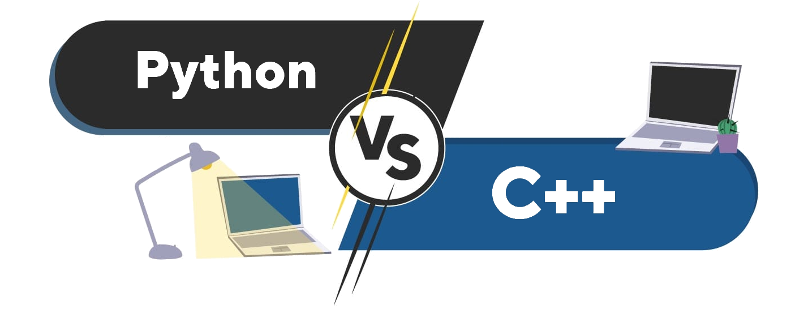

<h1 align="center"> Программирование</h1>

### Весенний семестр

#### Курсовая работа

- [Форма регистрации темы курсовой](https://docs.google.com/forms/d/e/1FAIpQLSed3KDin4GlgMbF6ifkVimKDlfiKGf9yix-tAInFuNkmAfWSg/viewform?usp=sf_link)
- [Оформление ВКР ФТИ](./resources/files/Oformlenie-VKR-FTI-2019.pdf)
- Примеры оформления курсовых работ 2019-2020
  - [Разработка клавиатурного тренажёра «TYPERR»](./resources/files/course_work_example/typerr.pdf)
  - [Система управления электрической нагрузкой с помощью сети интернет](./resources/files/course_work_example/control_system.pdf)
  - [Цифровая музыкальная студия с уклоном на быструю работу пользователя](./resources/files/course_work_example/music_studio.pdf)

#### Текущий контроль 1 (15.02.2021 - 14.03.2021)

- [Практические задания](./practice5.html)
- [Лабораторная работа №4](./lab4.html)
- [Лекция 4 (10.03.2021)](https://youtu.be/5-znSzcu6WM)

#### Текущий контроль 2 (15.03.2021 - 18.04.2021)

- [Практические задания](./practice6.html)
- [Лекция 5 (19.03.2021)](https://youtu.be/4TYCNn0MiBY)
- [Лекция 6 (24.03.2021)](https://youtu.be/dYyocymbLTw)
- [Лекция 7 (02.04.2021)](https://youtu.be/GYIXUCkpnaA)
- [Лекция 8 (07.04.2021)](https://youtu.be/7ifZ4yk8yLk)
- Дополнительные видео
  - [Статические и не статические поля класса](https://youtu.be/Ajr-Qp8SgkI)
  - [Демонстрация реализации класса Integer](https://youtu.be/6ebiXMUHOM0)

### Осенний семестр

#### Общее

- [Правила оценивания](./scores.html)
- [Плагиат](./plagiat.html)
- [Репозиторий](./repo.html)
- [Материалы](./docs.html)
- [Словарь](./dict.html)

#### Экзамен

- [Тест 100 рандомных вопросов из 213](https://www.classmarker.com/online-test/start/?quiz=e7r600360ce1dc1c)
- [Вопросы вынесенные на экзамен](./exam_questions.html)
- [Пример экзаменационной задачи](./resources/files/exam_task_example.pdf)
- [Процедура проведения экзамена](./exam.html)

#### Текущий контроль 1

- [Практические задания](./practice1.html)
- [Тест Блок 2 (06-10)](https://www.classmarker.com/online-test/start/?quiz=7695f7a2821a44ad)
- [Тест Блок 3 (11-15)](https://www.classmarker.com/online-test/start/?quiz=mv95f90bdad343b3)

#### Текущий контроль 2

- [Практические задания](./practice2.html)
- [Тест Блок 1 (23-24)](https://www.classmarker.com/online-test/start/?quiz=gvm5fb48b9bb15c9)
- [Лабораторная работа №1](./lab1.html)
- Презентации к лекциям и видео
  
  - [Лекция 2.1](./presentation/Лекция 2.1.pdf)
  - [Проблема больших файлов в git-репозитории](https://youtu.be/of1zfdZMIvY)
  - [Избавляемся от мусора в репозитории (.gitignore)](https://youtu.be/f2LuiJBRHTk)

#### Текущий контроль 3

- [Практические задания](./practice3.html)
- [Лабораторная работа №2](./lab2.html)

#### Текущий контроль 4

- [Практические задания](./practice4.html)
- [Лабораторная работа №3](./lab3.html)
- Презентации
  
  - [Лекция 2.6.1 Структуры](./presentation/Лекция 2.6.1.pdf)
  - [Лекция 2.6.2 Объединения. Перечисления](./presentation/Лекция 2.6.2.pdf)
  - [Лекция 2.7.1 Указатели](./presentation/Лекция 2.7.1.pdf)
  - [Лекция 2.7.2 Ссылки](./presentation/Лекция 2.7.2.pdf)