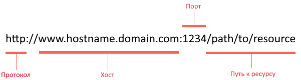
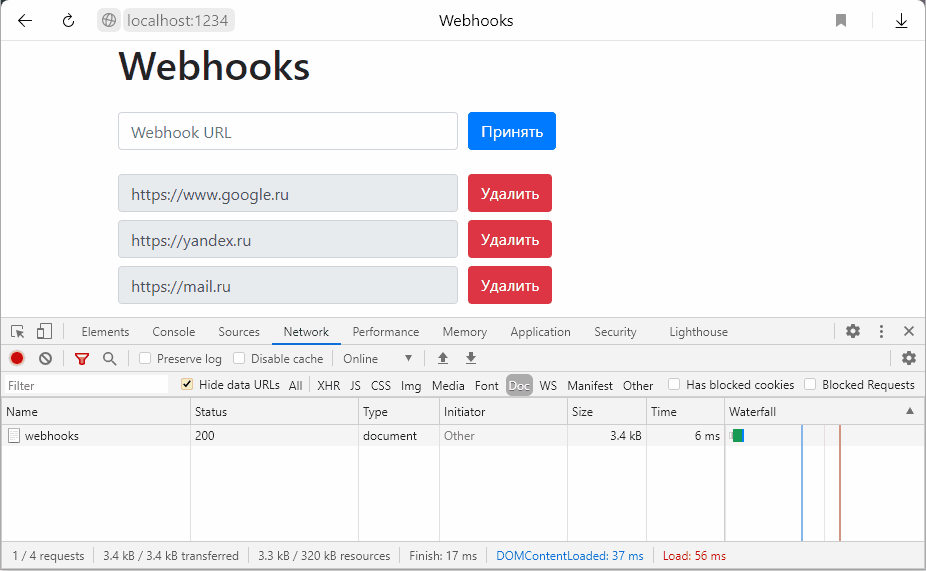
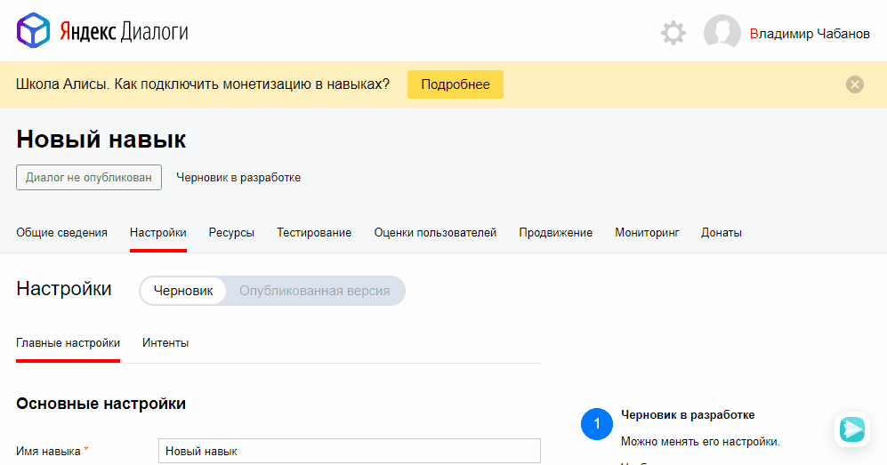
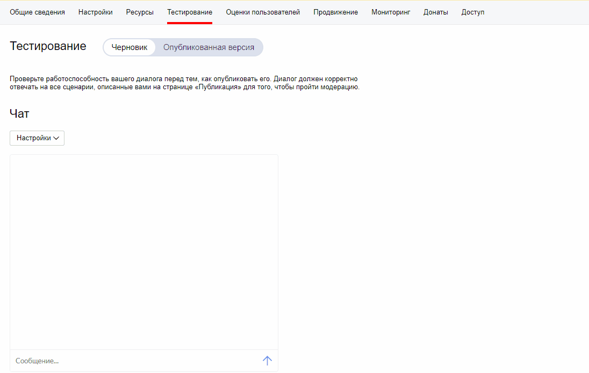

# Лабораторная работа №2 Алиса

**Цель:**

1. Получить представления о структуре post-запроса;
2. Изучить webhooks как метод взаимодействия web-приложений;

### Постановка задачи

1. Разработайте и зарегистрируйте навык для Алисы на сервисе ЯндексюДиалоги;
2. В качестве backend-a для навыка реализуйте приложение на языке С++ выполняющее следующие функции:
   1. Составление продуктовой корзины:
      - Добавление продукта в корзину;
      - Удаление продукта из корзины;
      - Очистка корзины;
      - Вывод списка товаров в корзине;
      - Подсчёт стоимости товаров в корзине.
   2. Вывод справочной информации по навыку;
   3. Регистрацию webhook-ов сторонних сервисов;
   4. Отправку данных на сторонние сервисы. 
3. В качестве стороннего сервиса реализуйте приложение на языке Python выполняющее следующие функции:
   1. Ожидание данных о покупке;
   2. Сохранение поступивших данных в excel-документ.

Подробности указаны далее.

### Ход работы

##### 0.I Введение. Структура http post-запроса

Общая схема post-запроса представлена на рисунке ниже:

<center></center>

<center><i>Рис. 1. Структура post-запроса</i></center>

**Протокол**: http, https.

**Хост**: доменное имя или ip-адрес сервера. Обычно по одному ip-адресу находится несколько сайтов, в этом случае доменное имя используется сервером, чтобы выбрать правильного получателя запроса.

**Сетевой порт**: число от 0 до 65535. Своеобразное расширения IP-адреса, нужен, чтобы несколько приложений на компьютере одновременно могли работать с сетью. Запрос приходит на IP-адрес, а дальше операционная система отдаёт его тому приложению, которое слушает порт указанный в запросе. Несколько приложений не могут одновременно слушать один и тот же порт благодаря этому пакет Skype не попадёт к Discord и т.д.
Обычно веб сервера слушают 80 и 443 порты. 80 - стандартный порт для http запросов, 443 - для https. Браузеры автоматически дописывают номера портов ориентируясь на название протокола, поэтому пользователю это делать не нужно.

**Путь к ресурсу**: просто строка. Приложение получившее запрос само решает как реагировать на эту строку. В целом структура пути к ресурсу не отличается у get и post запросов, но обычно у post-запроса путь указывает на какой-то обработчик (скрипт или функцию в web-приложении), а у get-запроса он вполне может указывать на статический файл (картинку, музыку, ...) .

В отличие от get-запросов post-запросы предназначены для отправки данных. Обычно именно этот метод выбирается для отправки данных html-форм, т.к. значения полей не отобразятся в адресной строке браузера и точно не попадут в кэш.


##### 0.II Введение. Что такое Webhook

О том ,что такое вебхук можно прочитать [тут](https://proglib.io/p/vebhuki-kak-poluchat-dannye-bez-promedleniya-i-oprosov-api-2019-11-09). 


##### 0.III Введение. C++ и utf-8

До сих пор в С++ не предусмотрен стандартный способ работы со строками в формате utf-8, но данный стандарт кодирования символьной информации сейчас настолько распространён, что по факту является общепринятой нормой хранить и обмениваться текстом именно в utf-8.

В данной лабораторной работе мы будем обходится стандартными возможностями языка.

1. Для хранения и работы со строками будем использовать `std::string`.

2. Любой строковой литерал в коде должен быть записан с префиксом `u8`.

   ```C++
   std::string str1 = u8"Привет, мир";                   // Обчная строка
   if (str1 == u8"Привет, мир") std::cout << 1;          // Сравнение строк
   std::string str1 = u8R"(Привет "Мир дикого запада")"; // Сырой строковой литерал
   ```

3. Поиск/замена/сравнение на равенство будут работать корректно, если всё будет в utf-8;

4. С выводом в терминал есть проблемы на windows. Большинство решений доступных на сегодняшний день не универсальны и зависят как от версии OC, так и от компилятора. Простейшим решением, в данном случае может быть сохранение вывода в файл и просмотр через текстовый редактор. Например Sublime Text, при получении фокуса, автоматически перезагружает содержимое файла, если он изменился.  
   В коде достаточно создать глобальный файловый поток и в дальнейшем пользоваться им вместо `cout`:

   ```c++
   #include <fstream>
   std::ofstream logger("log.txt");
    
   // Где-то дальше по коду
   logger << u8"Произошло событие" << std::endl;
   ```

   

##### I. Подготовка серверной части

Серверная часть отвечает за взаимодействие с Алисой, а так же за обработку и дальнейшую пересылку данных подчинённым сервисам. Язык серверного приложения: С++.

2. Для работы с сетью используйте библиотеку: https://github.com/yhirose/cpp-httplib.

   1. Клонируйте или скачайте в виде архива репозиторий библиотеки https://github.com/yhirose/cpp-httplib;

   2. В папке `include` проекта создайте папку `cpp_httplib` и скопируйте туда файл `httplib.h` из скаченного ранее репозитория. В дальнейшем сам репозиторий больше не потребуется, его можно удалить;

   3. Скопируйте и вставьте в главный `.cpp` файл следующий код:

      ```c++
      #include <iostream>
      #include <string>
      #include <cpp_httplib/httplib.h>
       
      using namespace httplib;
       
      // В этой функции формируем ответ сервера на запрос
      void gen_response(const Request& req, Response& res) {
          // Выводим на экран тело запроса
      	std::cout << req.body.c_str();
          // Здесь будет ответ, пока-что взят пример из документации
      	std::string str = u8R"(
      	{
            "response": {
              "text": "Здравствуйте! Это мы, хороводоведы.",
              "tts": "Здравствуйте! Это мы, хоров+одо в+еды.",
              "buttons": [
                  {
                      "title": "Надпись на кнопке",
                      "payload": {},
                      "url": "https://example.com/",
                      "hide": true
                  }
              ],
              "end_session": false
            },
            "version": "1.0"
          })";
          // Отправляем ответ
      	res.set_content(str, "text/json; charset=UTF-8");
      }
       
      int main() {
      	Server svr;                            // Создаём сервер (пока-что не запущен)
      	svr.Post("/", gen_response);           // Вызвать функцию gen_response на post запрос
      	std::cout << "Start server... OK\n"; // cout использовать нельзя
      	svr.listen("localhost", 1234);         // Запускаем сервер на localhost и порту 1234
      }
      ```
      
   4. Обратите внимание, что в отличие от прошлой лабораторной работы, в этом примере сервер отвечает не на get, а на post-запрос.  
   При попытке перейти по ссылке http://localhost:1234/ мы не получим от сервера никакого ответа, т.к. запрос будет отправлен методом get. Для быстрой проверки работоспособности кода вставьте в адресную строку браузера следующее:  
      
      ```html
      data:text/html,<form action=http://localhost:1234 method=post><input name=key></form>
      ```

      в появившемся поле введите любой текст и нажмите <kbd>Enter</kbd>.
   
3. В дальнейшем нам потребуется работать с JSON. Для этого используйте библиотеку: https://github.com/nlohmann/json.

   1. Скачайте файл `json.hpp` отсюда: https://github.com/nlohmann/json/releases. Его также можно найти в репозитории проекта https://github.com/nlohmann/json в папке: `single_include/nlohmann`.
   2. В папке `include` создайте папку `nlohmann` и скопируйте туда файл `json.hpp`.
   3. Добавьте в проект `#include <nlohmann/json.hpp>` и `using json = nlohmann::json;`

4. Взаимодействовать с подчинёнными сервисами будем посредством Webhook-ов. Для этого понадобится способ их регистрации и удаления во время работы сервера.

   1. Сразу после запуска сервер должен проверить наличие конфигурационного файла. Если файла нет, то создать (такой как указан ниже), если есть, загрузить.

   2. Конфигурационный файл - это текстовый файл в формате JSON следующей структуры:

      ```json
      {
          "webhooks":[]
      }
      ```

      В массиве `webhooks` перечислены все зарегистрированные вебхуки.

   3. Если серверу приходит get-запрос на `/webhooks`, сервер должен заполнить и отдать [html-шаблон](./lab2_files/dashboard.html).  В шаблоне нужно заменить заглушку `{webhooks_list}` на пустую строку, если ещё нет зарегистрированных webhook-ов или на блок указанный ниже если есть. Блок нужно повторить столько раз, сколько webhook-ов, при этом вместо `{Webhook URL}` должен быть конкретный webhook.

      ```html
      <div class="form-row align-items-center">
          <div class="col">
            <input type="text" value="{Webhook URL}" class="form-control mb-2" disabled>
          </div>
       
          <div class="col">
              <button type="submit" name="del" value="{Webhook URL}" class="btn btn-danger mb-2">Удалить</button>
          </div>
      </div>
      ```

      Пример как должен выглядеть [заполненный шаблон](./lab2_files/dashboard_example.html) с тремя зарегистрированными webhook-ами.

   4. Нажатие на любую из кнопок на странице приводит к отправке post-запроса на `/webhooks`. Если нажата кнопка `Принять` в запрос добавляется параметр `set` со значением равным тексту указанному в поле ввода которое вводится пользователем. Если нажата кнопка `Удалить`, в запрос добавляется параметр `del` со значением из соседнего поля ввода.

      <details>
        <summary>Демонстрация</summary>
        
      </details>

   5. При нажатии на кнопку (post-запрос) сервер должен отреагировать добавив новый webhook в список или удалив выбранный. Ответом на запрос должна быть обновлённая страница и все изменения должны быть сохранены в конфигурационный файл. Могут пригодиться:

      ```C++
      // Узнать какой запрос пришёл
      req.method == "GET";     // true или false
      req.method == "POST";    // true или false
      // Узнать есть ли параметр в запросе
      req.has_param("del");    // true или false
      // Получить значение параметра из запроса
      auto val = req.get_param_value("del");
      // Удалить данные из json-объекта по ключу. Удаляет весь массив
      j.erase("webhooks");
      // Удалить данные из json-массива по индексу. Удаляет элемент с индексом i
      j["webhooks"].erase(j["webhooks"].begin() + i);
      ```
   
5. В дальнейшем, по заданию, вам потребуется отсылать данные на все зарегистрированные webhook-и. Обычно это делается методом post. Для проверки корректности отправки данных на webhook воспользуемся ресурсом https://webhook.site

   1. Перейдите по указанной ссылке, в результате вы попадёте на страницу где для вас будет сгенерирован уникальный webhook URL (*Your unique URL*);

   2. В главном меню страницы, справой стороны нажмите кнопку Edit. В появившемся окне в поле *Response body* введите: `OK` и нажмите *Save*. Теперь на любой запрос сервис будет отвечать текстом: "OK";

   3. Создайте пустое консольное приложение, подключите библиотеку `cpp_httplib` и скопируйте и вставьте в главный `.cpp` файл следующий код:

      ```C++
      #include <iostream>
      #include <cpp_httplib/httplib.h>
      using namespace httplib;
       
      int main() {
          // Создаём клиент и привязываем к домену. Туда пойдут наши запросы
          Client cli("http://webhook.site");
          // Отправляем post в теле которого будет текст {"Hello": "world"}
          auto res = cli.Post("/bd748520-3009-4c3e-9323-affda0b34391", R"({"Hello": "world"})", "text/json");
          // res преобразуется в true, если запрос-ответ прошли без ошибок
          if (res) {
              // Проверяем статус ответа, т.к. может быть 404 и другие
              if (res->status == 200) {
                  // В res->body лежит string с ответом сервера
                  std::cout << res->body << std::endl;
              }
              else {
                  std::cout << "Status code: " << res->status << std::endl;
              }
          }
          else {
              auto err = res.error();
              std::cout << "Error code: " << err << std::endl;
          }
      }
      ```

   4. В примере замените данные на ваши (из *Your unique URL*). Убедитесь, что в коде протокол *http* иначе ничего не получится.

   5. Запустите код. В терминале вы должны увидеть сообщение "OK", а на странице https://webhook.site данные из вашего запроса.  
      **Примечание**: обратите внимание, что webhook URL, кроме домена, может содержать ещё и путь отличный от корня (как в данном примере), но из за особенностей библиотеки `cpp_httplib` нельзя указать полный URL в одном месте, домен и путь указываются в разных местах кода.


##### II. Подготовка Webhook URL для Алисы

Для взаимодействия с Алисой нам понадобится URL. В этом нам поможет ngrok:

1. Запустите ngrok указав http и порт, который слушает серверное приложение;
2. Скопируйте URL расположенный в поле `Forwarding` (тот, у которой протокол https);
3. Сверните ngrok и не закрывайте, пока выполняете лабораторную, иначе, при следующем запуске ngrok URL поменяется. 


##### III. Подготовка к работе с сервисом Яндекс.Диалоги

1. Создайте или используйте существующий аккаунт на Яндексе (заведите почту).

2. Перейдите на сервис Яндекс.Диалоги: https://dialogs.yandex.ru/

3. На главной странице нажмите кнопку ***Консоль*** или ***Создать навык***, после чего вы попадёте на *dashboard* со всеми созданными навыками. В начале там будет пусто;

4. Нажмите кнопку ***Создать диалог***, а затем ***Навык в Алисе*** и вы попадёте на страницу настройки навыка;

5. Заполните поля формы ([документация](https://yandex.ru/dev/dialogs/alice/doc/publish.html/#general__field-request-examples)):

   1. Имя навыка. Имена всех навыков находятся в одном пространстве имён, то есть вам нужно выбрать уникальное имя не совпадающее с уже существующими. Проверка происходит после сохранения настроек. Т.к. мы делаем не публичный навык, обычно, рекомендуют добавлять к названию фамилию. Например: Погода Пупкин.
   2. Активационное имя. Можно пропустить.
   3. Backend. Выберите Webhook URL и в поле ниже вставьте URL полученный от *ngrok*.  
       **Примечание**: каждый раз, когда вы будете закрывать *ngrok*, при новом запуске ссылка будет изменяться и её также придётся менять в данном поле и перепубликовывать навык. Для этого нажмите кнопку *Остановить диалог* в разделе *Общие сведения*, затем замените URL в разделе *Настройки* и заново опубликуйте навык.
   4. Голос. Выберите на своё усмотрение.
   5. Хранилище. Установите галочку в поле *Использовать хранилище данных в навыке*;
   6. Тип доступа. Приватный. В данном случае ваш навык будет доступен только под вашей учётной записью, другие пользователи не смогут его запустить.
   7. Доступные поверхности. Не меняем.
   8. Поля: Примеры запросов, Имя разработчика, Категорируя и Описание. Заполните на своё усмотрение.
   9. Иконка. Используйте любую иконку.
   
6. Нажмите ***Сохранить***, а затем ***Опубликовать***.  

   <details>
     <summary>Демонстрация</summary>
     
   </details>

7. Запустите серверное приложение (код из пункта I.3);

8. Перейдите в раздел навыка *Тестирование* и напишите любое сообщение в чат. Если ответ приходит, значит всё настроено правильно.

   <details>
     <summary>Демонстрация</summary>
     
   </details>
   
9. Изучите документацию: [Протокол работы навыка](https://yandex.ru/dev/dialogs/alice/doc/protocol.html/).


##### IV. Алгоритм работы серверного приложения (Сервера)

1. Сервер отвечает на [периодическую проверку](https://yandex.ru/dev/dialogs/alice/doc/health-check.html) от сервиса Яндекс.Диалоги.

2. При старте сессии (`["session"]["new"]`) сервер отправляет приветственное сообщение содержащее:

      - Текст: "Здравствуйте! Я помогу вам с покупками.";
      - Текст дублируется голосом;
      - Выводятся две кнопки с текстом "Помощь" и "Молчать".
      - [Сессионные данные](https://yandex.ru/dev/dialogs/alice/doc/session-persistence.html) по умолчанию:
        - Дублирование текста голосом: включено;
        - Корзина: пуста;
        - Режим работы навыка: основной.

3. Если сессия не новая:
   1. Достаёт сессионные данные. Если их нет или они не валидные:
      - Отправляет сообщение объясняющее пользователю, что произошла ошибка;
      - Закрывает сессию.
   3. Анализирует команду и режим работы навыка. В зависимости от чего и выбирает дальнейшие действия;

**Возможные запросы к навыку и алгоритм их обработки:**

1. Пользователь сказал или нажал кнопку "Молчать". Реакция:

   1. Все последующие сообщения в пределах сессии выводятся без озвучивания;
   2. Во всех последующих сообщениях кнопка "Молчать" заменяется на кнопку "Говорить";
   3. Выполнение действия подтверждается текстом: "Молчу, молчу".

2. Пользователь сказал или нажал кнопку "Говорить". Реакция:

   1. Все последующие сообщения в пределах сессии озвучиваются;
   2. Во всех последующих сообщениях кнопка "Говорить" заменяется на кнопку "Молчать";
   3. Выполнение действия подтверждается текстом и голосом: "Хорошо".

3. Пользователь сказал или нажал кнопку "Помощь":

   1. Режим работы навыка переключается в режим помощи;

   2. Отправляется стартовое сообщение режима помощи, содержащее:

      - Перечисление всех возможностей навыка в формате: короткое название и небольшое описание. Пример: "Корзина. Поможет организовать покупки". 
      - Завершающую фразу: "О чём рассказать подробнее?".
      - Кнопки с короткими названиями всех возможностей навыка и кнопка выхода из режима справки;

   3. Если названо/нажата кнопка с коротким названием возможности:

      - Вывести её более подробное описание;
      - Завершающую фразу: "О чём ещё рассказать?"
      - Кнопки с короткими названиями всех возможностей навыка и кнопка выхода из режима справки;

   4. Если пользователь захотел выйти из помощи:

      - Действие подтверждается фразой: "Обращайся ещё";

      - Кнопки основного режима;
      - Навык переключается в основной режим.

4. Возможность Корзина.  

   1. Команда "Очистить корзину". Реакция:

      - Корзина очищается;
      - Обновляются сессионные данные;
      - Действие подтверждается фразой: "Корзина пуста";

   2. Команда "Добавить в корзину". Для простоты полагаем, что:

      - Дважды один и тот же товар пользователь никогда не добавит;
      - Название товара не содержит цифр;
      - Цена товара - это целые рубли без копеек.

      То есть типичная команда выглядит так: "Добавить в корзину огурцы 20 рублей". Реакция:

      - В корзину добавляется новый товар;
      - Обновляются сессионные данные;
      - Действие подтверждается фразой: "ОК";

   3. Команда "Удалить из корзины". Пользователь должен назвать товар точно так же как и при добавлении. То есть "Огурец" и "Огурцы" - разные товары. Реакция:

      - Если товара нет в корзине:
        - Сообщает пользователю, что данного товара нет;
        - Сохраняет сессионные данные без изменения.
      - Если товар есть в корзине:
        - Удаляет товар из корзины;
        - Обновляются сессионные данные;
        - Действие подтверждается фразой: "ОК";

   4. Команда "Что в корзине". Реакция:

      - Если в корзине нет товаров:
        - Сообщает пользователю, что корзина пуста;

      - Если в корзине есть товары:
        - Перечисляет все товары в произвольном порядке в формате: Название и цена.

   5. Команда "Сумма". Реакция:

      - Определяет суммарную стоимость товаров в корзине;
      - Сообщает стоимость пользователю.

   6. Команда "Покупка завершена". Реакция:

      - Если в корзине есть хоть один товар, отправляет всем подписавшимся (всем webhook-ам) post-запрос с json в следующем формате:

        ```json
        {
            "user_id": "9359F683B13A18A1",
            "check":[
                {
                    "item": "сандальки",
                    "price": 250
                },
                {
                    "item": "носки",
                    "price": 100
                }
            ]
        }
        ```
      
      
      Где "user_id" содержит значение из `["session"]["user"]["user_id"] ` полученного от Алисы, если оно есть, иначе строку `"anonymous"`. "check" - массив всех товаров с ценами из чека.
      
      - Действие подтверждается фразой: "Заходите ещё";
      
      - Завершает сессию

5. Если поступила неизвестная команда, сервер отправляет сообщение, в котором:

   - Сообщает пользователю, что не знает команду;
   - Сохраняет сессионные данные без изменения. 

   **Примечание**: Считается, что пользователь всегда даёт команды в нужной словоформе, то есть "Помощь" и "Помоги" - разные команды. Навык должен реагировать только на правильную команду, дополнительные вариации предусматривать не обязательно (по желанию).


##### V. Клиентское приложение

Клиентское приложение предназначено для получения данных от сервера и сохранения их в excel-документ. Язык клиентского приложения: Python.

1. Для работы с Excel-документом удобно использовать модуль `openpyxl`. Модуль `openpyxl` можно установить при помощи `pip` :

   ```
   pip install openpyxl
   ```

   Изучите документацию с официального сайта: https://openpyxl.readthedocs.io/en/stable/  
   Работа с `openpyxl` продемонстрирована в этих видео: [запись](https://youtu.be/VQNV_oOdOqo), [чтение](https://youtu.be/d5jHpPSp5uI).
   
2. В отличие от предыдущей лабораторной работы клиентское приложение будет не отправлять запрос и обрабатывать ответ, а наоборот, ожидать пока к нему обратятся, то есть будет действовать по серверной логике. Модуль requests в данной ситуации нам не подойдёт.

3. Воспользуемся микрофреймворком [Flask](https://ru.wikipedia.org/wiki/Flask_(веб-фреймворк)). Небольшой вводный [видео курс](https://www.youtube.com/playlist?list=PLA0M1Bcd0w8yrxtwgqBvT6OM4HkOU3xYn).

   1. Установите Flask выполнив команду:

      ```
      pip install flask
      ```

   2. Создайте пустой скрипт, затем скопируйте и вставьте туда следующий код:

      ```python
      from flask import Flask
       
      app = Flask(__name__)
       
      @app.route('/')
      def index():
          return "Hello, World!"
       
      if __name__ == "__main__":
      	app.run()
      ```

      В результате запустится сервер, который будет слушать 5000 порт и на get-запросы к корню "сайта" будет вызывать функцию `index` . Всё, что вернёт функция `index` будет отправлено в ответ на запрос. Для проверки, перейдите по адресу: http://localhost:5000/. 

   3. По заданию клиентское приложение должно реагировать на post-запросы. Модифицируем код:

      ```python
      from flask import Flask, request
    
      app = Flask(__name__)
    
      @app.route('/', methods=['POST', 'GET'])
      def index():
          if request.method == 'POST':
              return "Это POST запрос"
          if request.method == 'GET':
              return "Это GET запрос"
    
      if __name__ == "__main__":
          app.run()
      ```
   
   4. Т.к. клиентское приложение будет получать данные от серверного приложения в формате json, то нам потребуется их достать из тела запроса. Для этого у request есть методы [json](https://werkzeug.palletsprojects.com/en/1.0.x/wrappers/#werkzeug.wrappers.json.JSONMixin.json) и [get_json](https://werkzeug.palletsprojects.com/en/1.0.x/wrappers/#werkzeug.wrappers.json.JSONMixin.get_json). Обратите внимание, что данные методы отработают корректно, только в том случае, если у посылаемых данных будет установлен *mimetype* как `application/json`. При любом другом и даже `text/json`  результат будет None.  
      Пример работы в flask с данными в формате json можно посмотреть в этом [видео](https://youtu.be/9ql0uA6ziJs).

**Алгоритм работы клиентского приложения:**

1. Клиентское приложение взаимодействует с сервером посредством webhook, подписываясь на событие: пользователь завершил покупку. Само приложение ничего не регистрирует, нужно это сделать руками.

2. Приложение ждёт post-запрос к корню ("/").

3. Когда запрос приходит, то:

   1. Полученные данные складываются в переменную-буфер. Данные приходят в json формате (структура описана выше).
   2. Отправляется ответ: "OK".

4. Когда количество записей в буфере превосходит 1000, данные сохраняются в excel-таблицу с именем `data.xlsx` и буфер очищается.

5. Сохранение в  excel-таблицу происходит по алгоритму:

   1. Если файл `data.xlsx` существует, то новые данные дописываются в конец таблицы.
   2. Если файлa нет, то он создаётся. При этом кроме данных, в строке с индексом 1 добавляется заголовок таблицы.

   Формат таблицы:

   |  N  | User ID | Datetime | Item | Prise |
   | :-: |   :-:   |    :-:   |  :-: |  :-:  |
   |     |         |          |      |       |

   Где "N" - номер записи в таблице начиная с 1 и далее с шагом 1; "User ID" - данные из поля `user_id` взятые из входящего json; "Datetime" - дата и время. Вычисляются на клиенте в момент получения данных ([например так](https://youtu.be/JI--7RqYkE0)); "Item" - название товара; "Prise" - цена товара.


### Что должно быть в отчёте

1. Отчёт по лабораторной работе оформляется в соответствии с указанными в разделе Правила оценивания [требованиями](./scores.html#лабораторные-задания).
2. В отчёте создайте раздел (заголовок второго уровня) *Постановка задачи* и продублируйте туда соответствующий блок из этого документа.
3. Создайте раздел (заголовок второго уровня) *Выполнение работы* и текстом подробно опишите всё, что делали в процессе выполнения. В описании обязательно должны присутствовать:
   1. Скриншот со страницы настроек навыка (должно быть видно название);
   2. Демонстрация работы функционала Корзина (достаточно скриншота с диалогом);
   3. Демонстрация работы функционала Помощь (достаточно скриншота с диалогом);
   4. Скриншот страницы управления webhook-ами с добавленным webhook-ом клиентского приложения;
   5. Ссылка на excel-файл заполненный клиентским приложением. Сам файл разместить в репозитории. Не обязательно делать 1000 записей, размер буфера можно уменьшить;
   6. Полный исходный код серверного приложения;
   7. Полный исходный код клиентского приложения;
4. В папке с лабораторной работой должно быть:
   1. Отчёт в файле ReadMe.md;
   2. Каталог с excel файлом;
   3. Каталог с серверным приложением на языке С++;
   4. Каталог с клиентским приложением на языке Python.