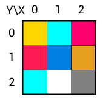
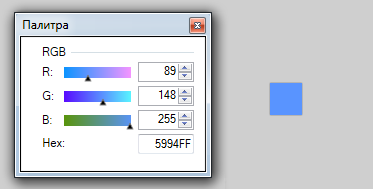
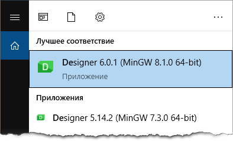
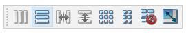
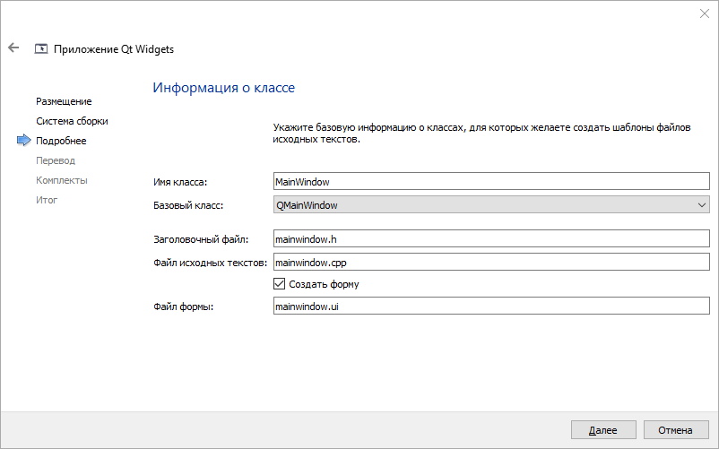
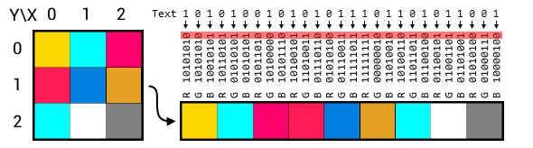
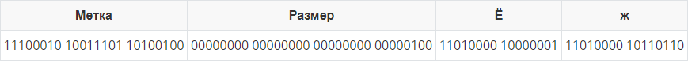

# Лабораторная работа №5 Стеганография

**Цель:**

1. Изучить базовые встроенные элементы фреймворка Qt предназначенные для создания приложений с графическим интерфейсом пользователя (GUI);
2. Изучить сигнально-слотовую систему, как один из способов организации взаимодействия компонентов GUI;
3. Получить практический навык работы с побитовыми операторами.

### Постановка задачи

Создать десктоп приложение с GUI позволяющее сохранять текстовую информацию в изображение формата *png* без видимого изменения исходного изображения. Приложение должно позволять сохранять текст в картинку и извлекать текст из картинки.

### Ход работы

#### 0. Введение

Изображение представляется в виде двумерной матрицы, элементом которой является пиксель.

Координаты каждого пикселя определяются парой чисел **X** и **Y** в указанном порядке. Начало отсчёта расположено в левом верхнем углу, **X** начинается с нуля и увеличивается слева на право, **Y** увеличивается сверху вниз. Размер изображения по **X** называется шириной (*width*) изображения, по **Y** - высотой (*height*) изображения.



<center><i>Рис. 1. Матричное представление изображения</i></center>

Основная характеристика пикселя - это его цвет. В зависимости от типа изображения, [глубины цвета](https://ru.wikipedia.org/wiki/Глубина_цвета) и наличия альфа канала информация о цвете пикселя может хранится в разном виде, например:

- 1 бит на пиксель. 0 - для одного цвета (например чёрного) и 1 для другого (например белого);
- одно целое число, которое является номером цвета в таблице цветов. Сама таблица может меняться в зависимости от изображения;
- группа чисел (каналы), каждое из которых определяет интенсивность одного из базовых цветов. Каналы могут быть заданы в разном порядке: ARGB, RGBA, BGR, CMYK и др.

В лабораторной работе будем считать, что информация о цвете пикселя определяется тремя отдельными каналами <b>R</b>ed, <b>G</b>reen, <b>B</b>lue. Каждый из каналов задаётся целым числом в диапазоне [0..255]. Каналы заданы в порядке: **RGB**.



<center><i>Рис. 2. RGB предствление цвета пикселя</i></center>

#### 1. Подготовка графического интерфейса

Предполагается, что у вас уже установлен Qt framework 6 или PySide6. Если нет, то перед выполнением этого раздела установите. Вместо 6й версии можно использовать другую, вместо PySide можно использовать PyQt.

1. Откройте дизайнер графического интерфейса Qt Designer.

   - Если установлен Qt framework:

     - Через поиск приложений. Откройте меню Пуск и начните набирать Designer. Выберите любую из доступных версий.  
       
       <center><br><i>Рис. 3. Меню Пуск</i></center>
       
     - Найти файл *designer.exe* вручную. Зайдите в корневую папку с установленным Qt **→** зайдите в папку с нужной версией фреймворка **→** затем в папку с инструментами сборки **→** перейдите в папку *bin*.  
       Путь может выглядеть, например так:  

       ```
       C:\Qt\6.0.1\mingw81_64\bin
       C:\Qt\5.14.2\mingw73_64\bin
       ```
     
   - Если установлен PySide:

     - Перейдите в папку с интерпретатором Python **→** перейдите в папку *Lib* **→** перейдите в папку *site-packages* **→** перейдите в папку *PySide6* **→** запустите *designer.exe*.  
       Путь может выглядеть, например так:  

       ```
       C:\Users\Professional\AppData\Local\Programs\Python\Python39\Lib\site-packages\PySide6
       ```
       
     - Тут же создайте папку `bin` и перенесите туда файл *uic.exe*. Если это не сделать, то функция преобразования UI в код будет не доступна из окна приложения Qt Designer, только из командной строки. Видимо это какой-то баг.

2. Как только Qt Designer запуститься, вы увидите диалоговое окно "Новая форма". Выберите "Main Window" и нажмите "Создать";

3. На панели виджетов найдите `Push Button` (для быстрого поиска вверху панели виджетов есть фильтр) и перетащите его на форму. Это обычная кнопка. Принцип работы: нажал **→** выполнилось какое-то действие. Всего создайте 4 кнопки;

4. Выберите первую кнопку и в окне "Редактор свойств" (по умолчанию находится с правой стороны) найдите свойство `text` (у этого окна тоже есть фильтр). Поменяйте текст на следующий: "Загрузить картинку";

5. У остальных кнопок поменяйте свойство `text` на: "Сохранить картинку", "Закодировать текст", "Декодировать текст";

6. Добавьте на форму виджет `Plain Text Edit`. Этот виджет - поле ввода простого многострочного текста. Есть поддержка Юникода, но не позволяет выводить форматированный текст (жирный, курсивный, цветной и т.д.). В лабораторной работе используется для ввода текста который нужно закодировать и для вывода декодированного текста.

7. В редакторе свойств этого виджета найдите свойство `placeholderText` и установите ему значение: "Введите текст".

8. Добавьте на форму виджет `Label`. Этот виджет позволяет выводить текст, который пользователь не может редактировать. В основном используется для подписи полей ввода или отображения вспомогательной информации. Есть поддержка Юникода, а также позволяет форматировать текст при помощи html css разметки. Например так (жирный красный Привет размером 10 пунктов):

   ```html
   <span style="font-size:10pt; color:#ff0000;"><b>Привет:</b></span>
   ```

9. Расположение виджетов выполните на своё усмотрение. Как вариант можно воспользоваться одним из встроенных компоновщиков. Для этого в окне "Инспектор объектов" выберите `centralwidget` и на панели инструментов (иконочки вверху окна) выберите "Скомпоновать по вертикали" или что-нибудь другое.

   <center><br><i>Рис. 4. Варианты компоновки</i></center>

10. Стилистическое оформление виджетов выполните на своё усмотрение. Кроме изменения свойств можно воспользоваться базовым CSS (свойство [*styleSheet*](https://doc.qt.io/qt-6/stylesheet-examples.html)). Например, если задать *styleSheet* элемента *MainWindow* таким образом:

    ```css
    QPushButton:hover{color: blue; font: bold 10pt;}
    ```

    То, при наведении мышки на любую из кнопок, текст на ней станет синим, жирным и размером 10 пунктов.

11. В окне "Инспектор объектов" найдите и удалите элементы `menubar` и `statusbar`.

12. В окне "Инспектор объектов" у вас должен быть корневой класса `QMainWindow`. Обрате внимание на имя этого элемента (по умолчанию `MainWindow`) в дальнейшем оно нам понадобится.

13. Итоговый интерфейс сохраните в файл.

#### 2. Программа на С++

Работать с полученным в предыдущем пункте файлом можно двумя способами:

- Экспортировать в код, затем полученный класс добавить руками в свой проект. Этот способ можно выбрать, если вы уже окончательно определились с дизайном интерфейса и хотите получить более оптимальный код графического интерфейса путём его собственноручного "допиливания";
- Подключить файл с интерфейсом к проекту и поручить среде Qt Creator автоматически генерировать и подключать необходимый код к проекту. При редактировании файла с интерфейсом среда будет сама экспортировать его в код, поэтому данный вариант подходит, если вы на стадии разработки интерфейса или в случае простого интерфейса.

Воспользуемся вторым способом. Для этого:

1. Откройте Qt Creator и создайте новый проект. Из списка шаблонов выберите "Приложение (Qt)" **→** "Приложение Qt Widgets".

2. Название проекта и систему сборки выберите на своё усмотрение. Можно оставить значения по умолчанию.

3. На странице "Информация о классе" Имя класса и Базовый класс должны в точности совпадать с именем и классом корневого объекта графического интерфейса (пункт 1.12). По умолчанию это `MainWindow` и `QMainWindow` соответственно. Имена файлов можно менять по своему усмотрению.

   <center><br><i>Рис. 5. Информация о классе</i></center>

4. На остальных страницах мастера создания проекта можно ничего не менять.

В созданном проекте уже будет файл графического интерфейса. Заменим его на свой:

1. Откройте папку с проектом. Например: в среде выберите любой файл и щёлкните по нему правой кнопкой мыши **→** выберите пункт "Показать в проводнике";
2. Переименуйте файл со своим графическим интерфейсом. В моём случае файл должен называться: *mainwindow.ui*;
3. Замените файл проекта на свой. При необходимости его можно будет изменять во встроенном в Qt Creator редакторе.

Если теперь запустить проект, то в результате откроется окно разработанное в Qt Designer, но пока что нажатие на кнопки ни к чему не приведёт. Перейдём к добавлению функционала. 

##### Загрузка изображения

Функционал загрузки изображения будем добавлять в 3 шага:

- Создадим слот, который выполнится при получении сигнала от кнопки;
- Добавим возможность указывать путь к изображению которое нужно загрузить;
- Добавим возможность загружать изображение в специальный объект-контейнер.

С точки зрения кода слот - это обычный метод класса, кроме того, что модификаторы доступа слотов, обычно содержат дополнительное слово `slots`, например: `public slots:`, `private slots:`. В качестве слота также можно использовать обычную или лямбда функцию. И наоборот, слот можно использовать как обычный метод класса.

Создадим слот который загрузит картинку при получении сигнала от кнопки. Для этого:

1. Перейдите в файл `mainwindow.h` и в классе `MainWindow` добавьте секцию `public slots:` в которой объявите слот: `void loadImage();`
2. Щёлкните правой кнопкой мыши по имени слота и выберите: Рефакторинг **→** Добавить реализацию в mainwindow.cpp
3. После чего будет автоматически создано пустое тело слота и вас перекинет в *mainwindow.cpp*.

Слот создан, но пока-что он не реагирует ни на какие сигналы. Для того, чтобы он начал это делать нужно присоединить его к сигналу. Для этого:

1. Перейдите в конструктор класса `MainWindow` (он в `mainwindow.сpp`). Соединить сигнал со слотом достаточно один раз, поэтому мы делаем это в конструкторе.

2.  Напишите код:

   ```c++
   connect(ui->pushButton, &QPushButton::clicked, this, &MainWindow::loadImage);
   ```

   `ui->pushButton` - это имя кнопки, сигналы от которой мы хотим слушать (источник сигнала). Данное имя определяется свойством `objectNаme` в окне редактора интерфейса;

   `QPushButton::clicked` - тип сигнала который слушаем. Амперсант указать обязательно.

   `this` - объект приёмник сигнала.

   `MainWindow::loadImage` - слот который выполнится при поступлении сигнала. Амперсант указать обязательно;

3. К одному сигналу можно подключить любое количество слотов и на оборот, но для этого придётся выполнить отдельный вызов `connect`. Один и тот же слот можно подключить к сигналу несколько раз, в этом случае он будет выполняться столько раз сколько был подключён. Отключить сигнал от слота можно при помощи `disconnect` с теми же параметрами.

Теперь при щелчке по кнопке с именем `pushButton` будет выполнятся код написанный в слоте `loadImage`. Сейчас тело слота пустое и нужно написать в нём код. Перейдите в тело слота `loadImage`.

Для выбора пути и имени картинки воспользуйтесь классом `QFileDialog`. Данный класс позволяет указать путь к файлу при помощи стандартного диалогового окна выбора файла. Изучите [документацию](https://doc.qt.io/qt-6/qfiledialog.html) и примеры и настройте диалоговое окно таким образом, чтобы оно позволяло выбирать только файлы с расширением `.png`. Один из вариантов:

```c++
QString fileName = QFileDialog::getOpenFileName(this, tr("Open Image"), "", tr("Допустимые форматы (*.png)"));
```

`tr()`  - принимает в качестве аргумента строку и заменяет её на другую строку. Эта штука нужна в том случае если вы пишите приложение с поддержкой нескольких языков и хотите дать пользователю возможность выбрать предпочитаемый язык интерфейса. Перевод на другие языки нужно писать самому. В нашем случае `tr` можно убрать и оставить просто строку.

Для загрузки изображения воспользуйтесь классом [`QImage`](https://doc.qt.io/qt-5/qimage.html). Для того, чтобы изображение было доступно и после выхода из слота перейдите в `mainwindow.h` и в классе `MainWindow` объявите поле `image` типа `QImage`. Вернитесь обратно в слот и загрузите картинку при помощи метода `load` которому нужно передать имя файла. В нашем случае имя файла вернётся ка результат работы `QFileDialog`. Если пользователь закроет диалог не выбрав файл, то `QFileDialog` вернёт пустую строку.

Как упоминалось ранее, формат данных о цвете может хранится в картинке по разному, поэтому преобразуем его к требуемому. Для этого выполните команду: 

```c++
image.convertTo(QImage::Format_ARGB32);
```

Если процедура загрузки картинки прошла успешно, поменяйте текст на элементе `label` на: "Изображение успешно загружено" иначе на: "Изображение не загружено". Для этого напишите в теле слота: 

```c++
ui->label->setText(); // В курглых скобочках нужно указать требуемы текст
```

##### Сохранение изображения

Прежде чем перейти непосредственно к кодированию текста научимся сохранять картинку в файл. Для этого:

1.  Добавьте слот `void saveImage();`. Действуйте так же как и при добавлении слота `loadImage`;
2. Соедините слот `saveImage` с сигналом от кнопки. Действуйте так же как и при соединении слота `loadImage`, но в качестве источника сигнала выберите кнопку на которой написано: "Сохранить картинку";
3. Перейдите в тело слота.

Для выбора пути и имени под которым будет сохранена картинка воспользуйтесь классом `QFileDialog`. В  [документации](https://doc.qt.io/qt-6/qfiledialog.html) можно найти примеры демонстрирующие вызов диалогового окна сохранения. Настройте фильтр расширений на работу только с `.png` файлами.

Сохранить изображение можно при помощи метода `save` поля `image`.  В качестве параметра метод принимает строку указывающую куда сохранять изображение.

Если процедура сохранения картинки прошла успешно, поменяйте текст на элементе `label` на: "Изображение успешно сохранено" иначе на: "Изображение не сохранено".

##### Кодирование сообщения

Текст набранный пользователем в `plainTextEdit` должен быть сохранён в изображение формата *png*, при этом часть информации используемой для кодирования цвета пикселей будет использована для сохранения сообщения. Для начала рассмотрим алгоритм который требуется реализовать. 

Любой текст - это последовательность символов, и каждому символу соответствует целочисленный код в выбранной кодировке. Для сохранения текста будем использовать кодировку *UTF-8*. Этот целочисленный код можно перевести в последовательность байт, а затем и бит. Следовательно и весь текст можно представить как одну длинную последовательность бит:

```
Привет, Мир!
110100001001111111010001100000001101000010111000110100001011001011010000101101011...
```

В свою очередь картинка - это последовательность пикселов. Будем брать их по рядам, то есть в порядке слева направо, сверху вниз. **Используйте именно такой порядок**. Пиксель - это последовательность трёх каналов RGB, где каждый канал представляется в виде 8 бит или числом в диапазоне [0 ... 255].

Чтобы изменения в картинке были не сильно заметны, для сохранения текста, будем использовать только младший бит каждого канала, то есть последовательно слева направо будем брать бит из текста и заменять им младший бит одного из каналов изображения.



<center><i>Рис. 6. Кодирование текста в картинку</i></center>

Заменить младший бит некоторого целого числа на другой можно несколькими способами. Вот некоторые из них:

Способ первый:

- Занульем последний бит при помощи побитовых сдвигов.
  Например: цвет канала 153. В бинарной форме 153 - это `1001 1001`. Выполняем сдвиг вправо и затем влево на 1 бит: `(153 >> 1) << 1` в итоге получаем `1001 1000` (в десятичном виде: 152).
- Прибавляем к получившемуся числу 1, если нужный бит 1, если 0, то ничего не делаем.
- Заменяем цвет канала на получившуюся сумму.

Способ второй:

- Берём ближайшее меньшее чётное, то есть если цвет канала - чётное число, ничего не меняем, если не чётное, отнимаем единицу.
  Например: цвет канала исходного изображения 131, значит отнимаем 1. Если 170, так и оставляем.
- Прибавляем к получившемуся числу 1, если нужный бит 1, если 0, то ничего не делаем.
- Заменяем цвет канала на получившуюся сумму.

Это почти всё, что нужно, чтобы сохранить текст в картинку. Но рано или поздно текст придётся из картинки извлечь, и тут возникает несколько вопросов:

- Есть ли в этой картинке закодированное сообщение?
- Какая длина сообщения или где оно заканчивается?

Для того, чтобы иметь возможность отличать картинки содержащие закодированное сообщение от остальных добавим в начало сообщения специальную метку. Чем больше длина метки, тем меньше вероятность ложной идентификации картинки как содержащей сообщение, но для лабораторной работы хватит и 24 бит. Пусть в качестве метки будет побитовое *UTF-8* представление символа `❤`:

```
11100010 10011101 10100100
```

Следом за меткой добавим информацию о размере сообщения, то есть сколько в нём байт. Для этой цели вполне достаточно 32 бита, которые позволят сохранять сообщения длиной от $0$ до $4\:294\:967\:296$ байт. Эти 32 бита можно представить как побитовое представление беззнакового целого числа (младший разряд справа), то есть:

```
1     → 00000000 00000000 00000000 00000001
5     → 00000000 00000000 00000000 00000101
10084 → 00000000 00000000 00100111 01100100
```

Следом за размером (`size`) располагаются `size` байт информации, которые являются закодированным сообщением. Всё, что после этих `size` байт может быть чем угодно.

Таким образом сообщение `Ёж` должно быть представлено следующей последовательностью бит:



<center><i>Рис. 7. Битовое представление закодированного сообщения</i></center>

Во всех примерах пробелы между байтами используются только для визуального удобства восприятия информации, на самом деле никаких пробелов добавлять НЕ нужно!

Перейдём непосредственно к реализации алгоритма кодирования. Для этого:

1.  Добавьте слот `void encodeMsg();`;
2.  Соедините слот `encodeMsg` с сигналом от кнопки "Закодировать текст";
3.  Перейдите в тело слота.

В теле слота реализуйте следующую последовательность действий:

1. Получите текст введённый пользователем в виджет `plainTextEdit` при помощи его метода `toPlainText()`. В результате вы получите `QString`.
2. Преобразуйте полученную строку в кодировку *UTF-8* при помощи метода `QString` - `toUtf8()`. В результате вы получите `QByteArray`;
3. Определите, сколько информации можно поместить в картинку из расчёта, что в каждый пиксель изображения можно записать 3 бита.
4. Если размер `QByteArray` плюс ключ, плюс информация о размере НЕ помещаются в изображение, то поменяйте текст на элементе `label` на: "Ошибка. Не достаточно места!". И выйдите из слота.
5. Поместите текст в картинку согласно алгоритму описанному выше. Вам могут понадобиться:
   - `pixelColor(int x, int y)` - метод класса [`QImage`](https://doc.qt.io/qt-6/qimage.html); Возвращает цвет пикселя с координатами (*x*, *y*) как объект класса [`QColor`](https://doc.qt.io/qt-6/qcolor.html);
   - `setPixelColor(int x, int y, const QColor &color)` - метод класса [`QImage`](https://doc.qt.io/qt-6/qimage.html); Устанавливает цвет пикселя с координатами (*x*, *y*) в значение *color*;
   - `red()`, `green()`, `blue()` - методы класса [`QColor`](https://doc.qt.io/qt-6/qcolor.html); Возвращают целое число соответствующее одноимённой компоненте цвета;
   - `setRed(int red)`, `setGreen(int green)`, `setBlue(int blue)` - методы класса [`QColor`](https://doc.qt.io/qt-6/qcolor.html); Устанавливают значение одноимённой компоненты цвета.
6. Поменяйте текст на элементе `label` на: "Сообщение добавлено в картинку!"

##### Декодирование сообщения

Подробно останавливаться на алгоритме декодирования не будем, зная алгоритм кодирования довольно легко понять как декодировать сообщение. Перейдём сразу к реализации:

1.  Добавьте слот `void decodeMsg();`;
2.  Соедините слот `decodeMsg` с сигналом от кнопки "Декодировать текст";
3.  Перейдите в тело слота.

В теле слота реализуйте следующую последовательность действий:

1. Проверьте наличие метки в изображении. Если метки нет, то поменяйте текст на элементе `label` на: "Сообщение не обнаружено". И выйдите из слота;

2. Если метка есть, то определите размер сообщения и поменяйте текст на элементе `label` на: "Присутствует сообщение длиной *{длина}* байт", например так:

   ```c++
   ui->label->setText(QString("Присутствует сообщение длиной %1 байт").arg(size));
   ```

   где `size` - переменная или выражение.

3. Восстановите сообщение из картинки. Вам могут понадобиться:

   - `QString::fromUtf8(const QByteArray& str)` - принимает массив байт и возвращает `QString`, если эти байты можно преобразовать в *UTF-8*;

4.  Выведите текст в виджет `plainTextEdit` при помощи его метода `setPlainText`.

##### Дополнительный плюшки

Чтобы пользователь понимал сколько ещё информации поместится в изображение реализуйте следующее:

1. Добавьте слот ` void msgChanged();`;
2. Соедините этот слот с сигналом `QPlainTextEdit::textChanged` от виджета `plainTextEdit`;
3. Перейдите в тело слота.

Как только пользователь будет изменять текст в `plainTextEdit` будет вызываться `msgChanged`.  В теле слота напишите:

1. Определите полное количество байт которые можно поместить в изображение;
2. Преобразуйте текст в `plainTextEdit` в `utf-8` и определите его размер в байтах;
3. Определите количество байт которое ещё можно ввести. При расчёте учитывайте место занимаемое меткой и размером;
4. Поменяйте текст на элементе `label` на: "Ещё можно ввести: *{количество}* байт".

##### Проверка работоспособности программы

Проверьте правильность реализации программы на [изображении](./lab5_files/img/saitama.png) [13.1 МБ].


#### 3. Программа на Python

Используя интерфейс реализованный в разделе первом и классы Qt напишите программу аналогичную по функционалу программе на С++ из раздела 2. 

Если у вас не установлен PySide6, то установите при помощи команды:

```
pip install pyside6
```

Вместо 6й можно использовать другую версию, вместо PySide можно использовать PyQt.

Так же как и в случае С++ работать с полученным в разделе первом файлом интерфейса можно несколькими [способами](https://doc.qt.io/qtforpython/tutorials/basictutorial/uifiles.html):

- Экспортировать в код, затем полученный класс добавить руками в свой проект;
- Загрузить .ui - файл во время выполнения скрипта без предварительного преобразования в класс;
- Подключить файл с интерфейсом к проекту созданному в среде Qt Creator. Шаблон: Приложение (Qt for Python) **→** Qt для Python - Окно (файл UI). В принципе ничего нового, по сравнению с первыми двумя пунктами, просто редактор встроен в среду разработки.  
  В стандартных шаблоны Qt Creator кривой код загрузки интерфейса, а для `QMainWindow` он вообще из коробки не работает.

Для определённости все указания будут даваться для случая экспорта Ui в класс, но разрешается писать любой код на своё усмотрение, главное получить правильный результат.

##### Экспорт UI в класс

1. Откройте Qt Designer;

2. В пункте главного меню Форма выберите Показать код Python. В результате будет сгенерирован класс `Ui_MainWindow`. Всё, что после `Ui_` определяется свойством `objectName` корневого элемента. Если у вас в проекте несколько форм, это свойство придётся менять, чтобы в коде не было конфликта имён.

3. Скопируйте созданный код в файл скрипта. Этот класс занимается тем, что создаёт виджеты и размещает их на форме, при этом саму форму класс не создаёт, а работает с той, что передали методу `setupUi`;

4. После Ui класса вставьте этот фрагмент:

   ```python
   class MainWindow(QMainWindow):
       def __init__(self):
           super(MainWindow, self).__init__()
           self.ui = Ui_MainWindow()
           self.ui.setupUi(self)
     
   if __name__ == "__main__":
       import sys
       app = QApplication(sys.argv)
     
       window = MainWindow()
       window.show()
     
       sys.exit(app.exec_())
   ```

5. Можно запускать.

##### Загрузка UI без преобразования в класс

1. Создайте скрипт и скопируйте туда код представленный ниже:

   ```python
   # -*- coding: utf-8 -*-
   import sys
   import os
     
   from PySide6.QtWidgets import QApplication, QMainWindow
   from PySide6.QtCore import QFile
   from PySide6.QtUiTools import QUiLoader
     
     
   if __name__ == "__main__":
       app = QApplication(sys.argv)
       
       path = os.path.join(os.path.dirname(__file__), "form.ui")
       ui_file = QFile(path)
       ui_file.open(QFile.ReadOnly)
       
       loader = QUiLoader()
       window = loader.load(ui_file)
       ui_file.close()
       
       window.show()
       sys.exit(app.exec_())
   ```
   
2. Для данного примера файл с интерфейсом должен лежать в той же папке и называться *form.ui*

3. Можно запускать.

##### Загрузка изображения

Большая часть кода этого и следующих разделов будет идентична коду на С++, с точностью до синтаксиса языка, но в некоторых случая встречаются нюансы. Например: везде, где в С++ коде были `QString` теперь будут обычные python строки; любые массивы, будут python-списками.

Функционал загрузки изображения будем добавлять в 3 шага:

- Создадим слот, который выполнится при получении сигнала от кнопки;
- Добавим возможность указывать путь к изображению которое нужно загрузить;
- Добавим возможность загружать изображение в специальный объект-контейнер.

С точки зрения кода слотом может быть метод любого класса обычная или даже лямбда функция, но для корректной работы рекомендуется создавать слоты как методы класса унаследованного от `QObject  ` (любой класс Qt наследуется от `QObject`) и добавлять им декоратор `@Slot()`. Этот декоратор находятся в модуле `QtCore`.

Создадим слот который загрузит картинку при получении сигнала от кнопки. Для этого:

1. Перейдите в тело класса `MainWindow` и объявите слот:

   ```python
   @Slot()
   def loadImage(self):
       pass
   ```

   Слот создан, но пока-что он не реагирует ни на какие сигналы. Для того, чтобы он начал это делать нужно присоединить его к сигналу. Для этого:

   1. Перейдите в метод `__init__` класса класса `MainWindow` и напишите код:

      ```c++
      self.ui.pushButton.clicked.connect(self.loadImage)
      ```

      `self.ui.pushButton` - это имя кнопки, к сигналу которой подключаем слот (источник сигнала). Данное имя определяется свойством `objectNаme` в окне редактора интерфейса;

      `clicked` - тип сигнала;

      `self` - объект приёмник сигнала (в нашем случае он же и хозяин источника);

      `loadImage` - слот который выполнится при поступлении сигнала.

   2. К одному сигналу можно подключить любое количество слотов и на оборот. Один и тот же слот можно подключить к сигналу несколько раз, в этом случае он будет выполняться столько раз сколько был подключён. Для отключения сигнала от слота нужно использовать ту же команду только вместо `connect` написать `disconnect`.

   Теперь при щелчке по кнопке с именем `pushButton` будет выполнятся код написанный в слоте `loadImage`. Сейчас тело слота пустое и нужно написать в нём код. Перейдите в тело слота `loadImage`.

   Для выбора пути и имени картинки воспользуйтесь классом `QFileDialog`. Изучите [документацию](https://doc.qt.io/qtforpython/PySide6/QtWidgets/QFileDialog.html) и примеры и настройте диалоговое окно таким образом, чтобы оно позволяло выбирать только файлы с расширением `.png`. Один из вариантов:

   ```c++
   fileName, _ = QFileDialog.getOpenFileName(self, self.tr("Open Image"), "", self.tr("Доступные форматы (*.png)"))
   ```

   В данном случае есть отличие от С++ кода. `getOpenFileName` возвращает не просто имя файла, а кортеж из имени файла и фильтра форматов, поэтому имя файла принимаем в `fileName`, а второй параметр игнорируем.

   `tr()` тоже можно убрать. Здесь он указан просто как пример использования.

   Для загрузки изображения воспользуйтесь классом [`QImage`](https://doc.qt.io/qtforpython/PySide6/QtGui/QImage.html). Для того, чтобы изображение было доступно и после выхода из слота добавим в класс `MainWindow` поле `self.image` типа `QImage` в которое и загрузим картинку при помощи метода `load` которому нужно передать имя файла.

   Как упоминалось ранее, формат данных о цвете может хранится в картинке по разному, поэтому преобразуем его к требуемому. Для этого выполните команду: 

   ```c++
   self.image.convertTo(QImage.Format_ARGB32)
   ```

   Если процедура загрузки картинки прошла успешно, поменяйте текст на элементе `label` на: "Изображение успешно загружено" иначе на: "Изображение не загружено". Для этого напишите: 

   ```c++
   self.ui.label.setText(); // В курглых скобочках нужно указать требуемы текст
   ```


##### Сохранение изображения

Прежде чем перейти непосредственно к кодированию текста научимся сохранять картинку в файл. Для этого:

1.  Добавьте слот `saveImage`. Действуйте так же как и при добавлении слота `loadImage`;
2.  Соедините слот `saveImage` с сигналом от кнопки. Действуйте так же как и при соединении слота `loadImage`, но в качестве источника сигнала выберите кнопку на которой написано: "Сохранить картинку";
3.  Перейдите в тело слота.

Для выбора пути и имени под которым будет сохранена картинка воспользуйтесь классом `QFileDialog`. В  [документации](https://doc.qt.io/qtforpython/PySide6/QtWidgets/QFileDialog.html) можно найти примеры демонстрирующие вызов диалогового окна сохранения. Настройте фильтр расширений на работу только с `.png` файлами.

Сохранить изображение можно при помощи метода `save` поля `image`.  В качестве параметра метод принимает строку указывающую куда сохранять изображение.

Если процедура сохранения картинки прошла успешно, поменяйте текст на элементе `label` на: "Изображение успешно сохранено" иначе на: "Изображение не сохранено".

##### Кодирование сообщения

Алгоритм добавления текста в изображения описан в одноимённом пункте раздела 2, поэтому перейдём непосредственно к реализации. Для этого:

1.  Добавьте слот `encodeMsg`;
2.  Соедините слот `encodeMsg` с сигналом от кнопки "Закодировать текст";
3.  Перейдите в тело слота.

В теле слота реализуйте следующую последовательность действий:

1. Получите текст введённый пользователем в виджет `plainTextEdit` при помощи его метода `toPlainText()`. В результате вы получите обычную python-строку.
2. Воспользуйтесь методом python-строки [`encode()`](https://pythononline.ru/osnovy/encode-decode), чтобы получить список байт. Можно явно указать кодировку `encode('utf-8')`, но в Python3 строки по умолчанию хранятся в формате *UTF-8*, поэтому результат будет один и тот же;
3. Определите, сколько информации можно поместить в картинку из расчёта, что в каждый пиксель изображения можно записать 3 бита.
4. Если размер списка байт плюс ключ, плюс информация о размере НЕ помещаются в изображение, то поменяйте текст на элементе `label` на: "Ошибка. Не достаточно места!". И выйдите из слота.
5. Поместите текст в картинку согласно алгоритму описанному в одноимённом пункте раздела 2. Вам могут понадобиться:
   - `pixelColor(x, y)` - метод класса [`QImage`](https://doc.qt.io/qtforpython/PySide6/QtGui/QImage.html); Возвращает цвет пикселя с целочисленными координатами (*x*, *y*) как объект класса [`QColor`](https://doc.qt.io/qtforpython/PySide6/QtGui/QColor.html);
   - `setPixelColor(x, y, color)` - метод класса [`QImage`](https://doc.qt.io/qtforpython/PySide6/QtGui/QImage.html); Устанавливает цвет пикселя с целочисленными координатами (*x*, *y*) в значение *color* типа [`QColor`](https://doc.qt.io/qtforpython/PySide6/QtGui/QColor.html);
   - `red()`, `green()`, `blue()` - методы класса [`QColor`](https://doc.qt.io/qtforpython/PySide6/QtGui/QColor.html); Возвращают целое число соответствующее одноимённой компоненте цвета;
   - `setRed(red)`, `setGreen(green)`, `setBlue(blue)` - методы класса [`QColor`](https://doc.qt.io/qtforpython/PySide6/QtGui/QColor.html); Устанавливают значение одноимённой компоненты цвета в соответствии с переданным как параметр целым числом.
6. Поменяйте текст на элементе `label` на: "Сообщение добавлено в картинку!"

##### Декодирование сообщения

Подробно останавливаться на алгоритме декодирования не будем, зная алгоритм кодирования довольно легко понять как декодировать сообщение. Перейдём сразу к реализации:

1.  Добавьте слот `decodeMsg`;
2.  Соедините слот `decodeMsg` с сигналом от кнопки "Декодировать текст";
3.  Перейдите в тело слота.

В теле слота реализуйте следующую последовательность действий:

1. Проверьте наличие метки в изображении. Если метки нет, то поменяйте текст на элементе `label` на: "Сообщение не обнаружено". И выйдите из слота;

2. Если метка есть, то определите размер сообщения и поменяйте текст на элементе `label` на: "Присутствует сообщение длиной *{длина}* байт", например так:

   ```c++
   self.ui.label.setText(f"Присутствует сообщение длиной {size} байт")
   ```

   где `size` - переменная.

3. Восстановите байты из картинки и при помощи метода python-строки [`decode()`](https://pythononline.ru/osnovy/encode-decode), преобразуйте этот список байт в строку. Кодировка по умолчанию: *UTF-8*;

4. Выведите текст в виджет `plainTextEdit` при помощи его метода `setPlainText`.

##### Дополнительный плюшки

Чтобы пользователь понимал сколько ещё информации поместится в изображение реализуйте следующее:

1. Добавьте слот ` msgChanged`;
2. Соедините этот слот с сигналом `textChanged` от виджета `plainTextEdit`;
3. Перейдите в тело слота.

Как только пользователь будет изменять текст в `plainTextEdit` будет вызываться `msgChanged`.  В теле слота напишите:

1. Определите полное количество байт которые можно поместить в изображение;
2. Преобразуйте текст в `plainTextEdit` в список байт и определите его размер;
3. Определите количество байт которое ещё можно ввести. При расчёте учитывайте место занимаемое меткой и размером;
4. Поменяйте текст на элементе `label` на: "Ещё можно ввести: *{количество}* байт".

##### Проверка работоспособности программы

Проверьте правильность реализации программы на [изображении](./lab5_files/img/saitama.png) [13.1 МБ].

### Что должно быть в отчёте

1. Отчёт по лабораторной работе оформляется в соответствии с указанными в разделе Правила оценивания требованиями.
2. В отчёте создайте раздел (заголовок второго уровня) *Постановка задачи* и продублируйте туда соответствующий блок из этого документа.
3. Создайте раздел (заголовок второго уровня) *Выполнение работы* и текстом подробно опишите всё, что делали в процессе выполнения.
4. Кроме стандартных элементов добавьте в отчёт:
   1. Скриншот разработанного вами графического интерфейса;
   2. Ответ на вопрос про зашифрованное сообщение: Кто и что обещал?
   3. Любая картинка в формате *.png* с любым зашифрованным текстом. 
5. В папке с лабораторной работой должно быть:
   1. Отчёт в файле ReadMe.md;
   2. Каталоги с С++ и Python кодом;

### Ссылки

1. Форматы изображений [видео]: [часть1](https://youtu.be/P1K0ZNGczsk), [часть2](https://youtu.be/G5Q2CltA_Pc)
2. [Что такое RGB и CMYK? [видео]](https://youtu.be/d4rnOernb2s)
3. [Юникод: необходимый практический минимум для каждого разработчика](https://habr.com/ru/post/312642/)
4. [Побитовые операторы](https://ravesli.com/urok-45-pobitovye-operatory/)
5. [Битовые флаги и битовые маски](https://ravesli.com/urok-46-bitovye-flagi-i-bitovye-maski/)
6. [Документация PySide6](https://doc.qt.io/qtforpython/index.html)
7. [Стеганография в XXI веке. Цели. Практическое применение. Актуальность](https://habr.com/ru/post/253045/)